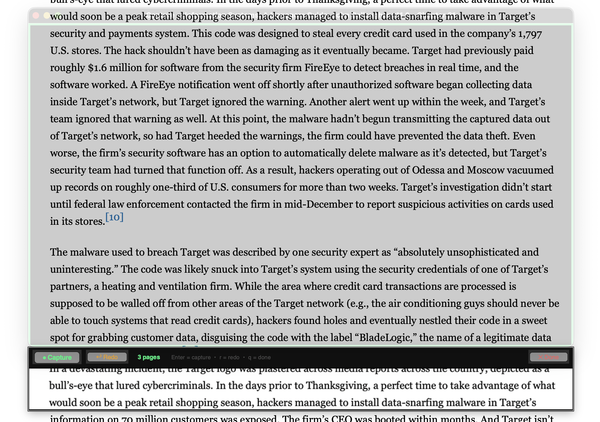

# textbook2audiobook

I found myself looking for a way to turn my online textbooks into audiobooks so I could play Wii Sports Resort and feel productive. 

Also really didn't want to shill out extra cash to get the audiobook add-on for a textbook which I am already subscribing to. 

Capture online textbook pages via screenshot and convert them to an audiobook.
Uses [ebook2audiobook](https://github.com/DrewThomasson/ebook2audiobook) for
OCR (tesseract) and text-to-speech. 
Outputs audiobooks in .m4b file format for MacOS Books/IOS Itunes apps. 

Really just screen capture middleware for ebook2audiobook. Currently building an audiobook is slow going for any substantial number of captures. Considering using Claude Haiku vision to process images into text via API call and then using ebook2audiobook. Maybe cost a $1 or 2 per book. Not sure yet whether the speed bottleneck is the OCR or TTS engine. 

Use requires some scrolling, clicking and paying attention but presumably your AI agent can do that for you. 

**Will be testing with OpenClaw soon -> Maybe OpenClaw could do an audiobook conversion without this middleware, unsure yet.**

Screenshot of what it looks like:


## Requirements

- Knowledge of Github, comfortable using the command line, organizing and navigating directories 
- macOS (uses `screencapture` and tkinter)
- Python 3.11+
- [ebook2audiobook](https://github.com/DrewThomasson/ebook2audiobook) installed locally
- tesseract and calibre (`ebook-convert`) — required by ebook2audiobook, should be installed by native installation

Install [ebook2audiobook](https://github.com/DrewThomasson/ebook2audiobook)
Follow instructions on their GitHub page, express/default installation is fine. 

Install Python dependencies:

```bash
pip3 install -r requirements.txt
```

## Quick Start

```bash
# 1. Create a session
python3 main.py new

# 2. Capture pages (opens a transparent overlay window)
python3 main.py capture

# 3. (Optional) Create a PDF for viewing
python3 main.py pack

# 4. Convert to audiobook
python3 main.py audio
```

## Commands

### `new`

Create a new capture session. Prompts for a book title.

```bash
python3 main.py new
```

### `capture`

Opens a resizable transparent window over your screen. Position and resize it
to frame your textbook content, then capture each page.

```bash
python3 main.py capture
python3 main.py capture -s <session_id>   # specific session
```

**Controls:**
| Input | Action |
|-------|--------|
| Capture button / Enter | Screenshot the framed region |
| Redo button / r | Delete the last screenshot |
| Done button / q / Escape | Save and exit |

After each capture, the bottom of the page is shown in the overlap strip so
you know where to start scrolling for the next page.

### `pack`

Combine captured screenshots into a PDF (one image per page).

```bash
python3 main.py pack
python3 main.py pack -o custom_output.pdf
```

Output: `output/<title>.pdf`

### `audio`

Convert captured pages to an audiobook via ebook2audiobook. Builds a multi-page
TIFF from your screenshots (ebook2audiobook OCRs each page with tesseract),
then runs text-to-speech.

```bash
python3 main.py audio
python3 main.py audio -s <session_id>
python3 main.py audio -o ./my_output/
```

Extra flags are forwarded to ebook2audiobook:

```bash
python3 main.py audio -- --tts_engine edge --voice en-US-AndrewNeural
```

Output: `output/<title>_audiobook/`

On first run, you'll be prompted for your ebook2audiobook install path. This
is saved to `~/.textbook2audiobook/e2a_path` for future use.

### `sessions`

List all saved capture sessions.

```bash
python3 main.py sessions
```

## File Layout

```
textbook2audiobook/
├── sessions/              # Created at runtime
│   └── <session_id>/
│       ├── session.json
│       └── screenshots/
│           ├── 0001.png
│           └── ...
├── output/                # Created at runtime
│   ├── <title>.pdf        # From pack
│   ├── <title>.tiff       # Intermediate (from audio)
│   └── <title>_audiobook/ # From audio (ebook2audiobook output)
├── main.py
├── session.py
├── capture.py
└── requirements.txt
```

## macOS Permissions

Screen Recording permission is required. If you see a permission error:

1. Open **System Settings > Privacy & Security > Screen Recording**
2. Enable your terminal app
3. Re-run the command
